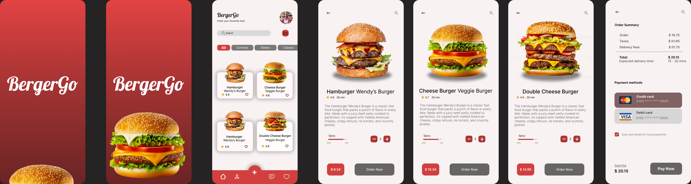

# BergerGo 🍔  
A responsive and visually appealing food ordering website showcasing delicious burger options, built using **HTML**, **CSS**, and **JavaScript**.

## 📸 Project Preview  
  

### 🔗 Live Preview  
Check out the live demo: [BergerGo Live Preview](https://short-zed.github.io/BergerGo/) 

  

---

## 🛠️ Features  
- **Interactive UI**: Add or subtract quantity directly on the product details page.  
- **Order Summary**: Shows taxes, delivery fees, and the total amount.  
- **Payment Options**: Multiple payment methods are displayed for user convenience.  

---

## 💻 Technologies Used  
- **HTML**: Structure of the application.  
- **CSS**: For styling and responsive design.  
- **JavaScript**: Dynamic interactions and functionality.  

---

## 🚀 Getting Started  

### Prerequisites  
- A code editor like **VS Code**.  
- A web browser to preview the project.  

### Installation  
1. Clone the repository:  
   ```bash  
   git clone https://github.com/Short-Zed/BergerGo.git 
